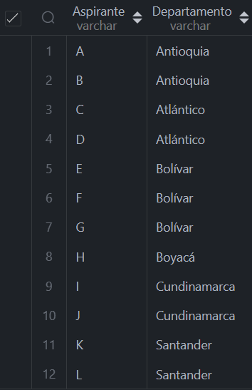
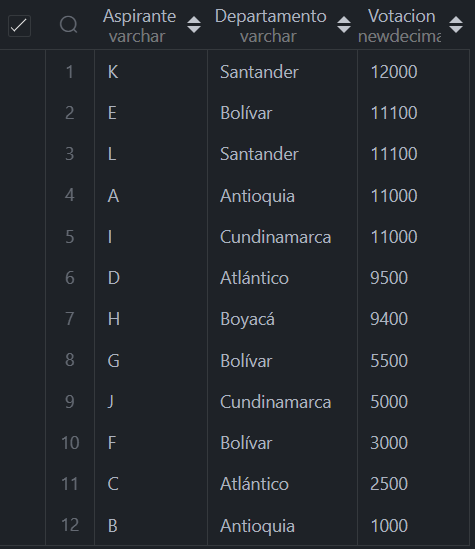
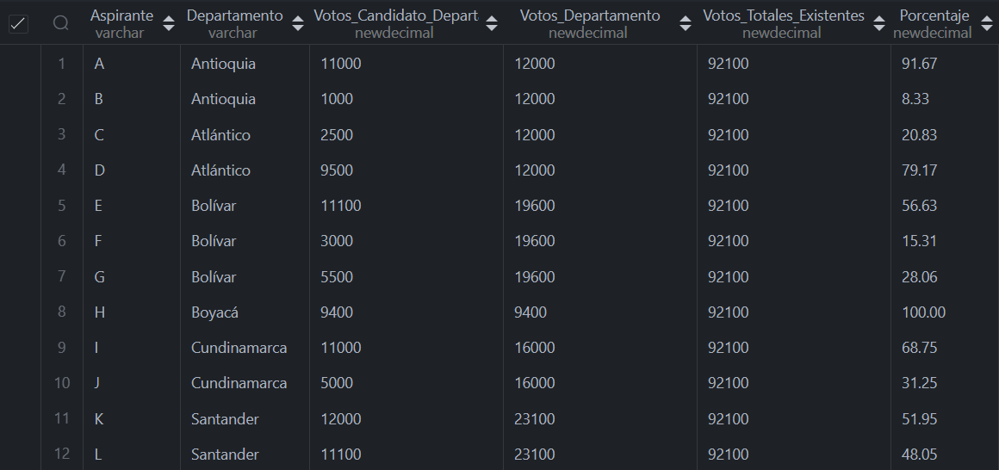
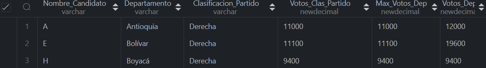
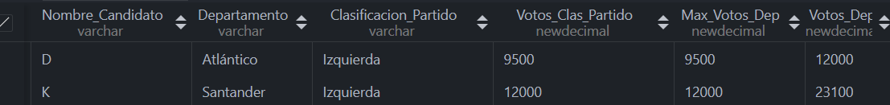
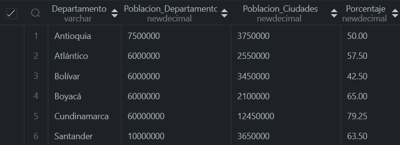

### Bloque 1

##### Consultas

1. Nombres Completos de todos los Aspirantes a la asamblea de cada Departamento

  ```sql
    SELECT DISTINCT c.nombre AS Aspirante, d.nombre AS Departamento
    FROM candidato c, departamento d, ciudad ci
    WHERE ci.id_candidato = c.id_candidato 
    AND ci.id_departamento = d.id_departamento;
  ```


2. Votación de Cada Aspirante a la asamblea de todos los Departamentos Ordenados por número Total de Votos

  ```sql
    SELECT c.nombre AS Aspirante, d.nombre AS Departamento, 
    SUM(ci.votos_ciudad) AS Votacion
    FROM candidato c, departamento d, ciudad ci
    WHERE ci.id_candidato = c.id_candidato 
    AND ci.id_departamento = d.id_departamento
    GROUP BY c.id_candidato
    ORDER BY Votacion DESC;
  ```


3. Porcentaje de Votación de Cada Aspirante a la asamblea respecto al total de votos por departamento.

  ```sql
    SELECT c.nombre AS Aspirante, d.nombre AS Departamento, 
    SUM(ci.votos_ciudad) AS Votos_Candidato_Departamento,
    SUM(SUM(ci.votos_ciudad)) OVER(PARTITION BY d.id_departamento) AS Votos_Departamento,
    (SELECT SUM(votos_ciudad) FROM ciudad) AS Votos_Totales_Existentes,
    ROUND(SUM(ci.votos_ciudad)*100/SUM(SUM(ci.votos_ciudad)) OVER(PARTITION BY d.id_departamento), 2) AS Porcentaje
    FROM candidato c JOIN ciudad ci ON c.id_candidato = ci.id_candidato
    JOIN departamento d ON ci.id_departamento = d.id_departamento
    GROUP BY d.id_departamento, ci.id_candidato
    ORDER BY d.nombre;
  ```


4. Departamentos donde ganó la Derecha

  ```sql
    SELECT
        Nombre_Candidato,
        Departamento,
        Clasificacion_Partido,
        Votos_Clas_Partido
        Max_Votos_Dep,
        Votos_Dep
    FROM( 
        SELECT 
            c.nombre AS Nombre_Candidato, 
            d.nombre AS Departamento, 
            cp.nombre AS Clasificacion_Partido, 
            SUM(ci.votos_ciudad) AS Votos_Clas_Partido,
            MAX(SUM(ci.votos_ciudad)) OVER(PARTITION BY d.id_departamento) AS Max_Votos_Dep, 
            SUM(SUM(ci.votos_ciudad)) OVER(PARTITION BY d.id_departamento) AS Votos_Dep
            FROM clasificacion_partido cp JOIN 
            partido p ON cp.id_clasificacion = p.id_clasificacion JOIN
            candidato c ON p.id_partido = c.id_partido JOIN 
            ciudad ci ON c.id_candidato = ci.id_candidato
        JOIN departamento d ON ci.id_departamento = d.id_departamento
        GROUP BY d.id_departamento, cp.id_clasificacion
    ) AS Subconsulta
    WHERE Votos_Clas_Partido = Max_Votos_Dep AND Clasificacion_Partido = 'Derecha'
    ORDER BY Departamento;
  ```


5. Departamentos donde ganó la Izquierda

  ```sql
    SELECT
        Nombre_Candidato,
        Departamento,
        Clasificacion_Partido,
        Votos_Clas_Partido
        Max_Votos_Dep,
        Votos_Dep
    FROM( 
        SELECT 
            c.nombre AS Nombre_Candidato, 
            d.nombre AS Departamento, 
            cp.nombre AS Clasificacion_Partido, 
            SUM(ci.votos_ciudad) AS Votos_Clas_Partido,
            MAX(SUM(ci.votos_ciudad)) OVER(PARTITION BY d.id_departamento) AS Max_Votos_Dep, 
            SUM(SUM(ci.votos_ciudad)) OVER(PARTITION BY d.id_departamento) AS Votos_Dep
            FROM clasificacion_partido cp JOIN 
            partido p ON cp.id_clasificacion = p.id_clasificacion JOIN
            candidato c ON p.id_partido = c.id_partido JOIN 
            ciudad ci ON c.id_candidato = ci.id_candidato
        JOIN departamento d ON ci.id_departamento = d.id_departamento
        GROUP BY d.id_departamento, cp.id_clasificacion
    ) AS Subconsulta
    WHERE Votos_Clas_Partido = Max_Votos_Dep AND Clasificacion_Partido = 'Izquierda'
    ORDER BY Departamento;
  ```


6. Departamentos donde ganó la Centro-Derecha

  ```sql
    SELECT
        Nombre_Candidato,
        Departamento,
        Clasificacion_Partido,
        Votos_Clas_Partido
        Max_Votos_Dep,
        Votos_Dep
    FROM( 
        SELECT 
            c.nombre AS Nombre_Candidato, 
            d.nombre AS Departamento, 
            cp.nombre AS Clasificacion_Partido, 
            SUM(ci.votos_ciudad) AS Votos_Clas_Partido,
            MAX(SUM(ci.votos_ciudad)) OVER(PARTITION BY d.id_departamento) AS Max_Votos_Dep, 
            SUM(SUM(ci.votos_ciudad)) OVER(PARTITION BY d.id_departamento) AS Votos_Dep
            FROM clasificacion_partido cp JOIN 
            partido p ON cp.id_clasificacion = p.id_clasificacion JOIN
            candidato c ON p.id_partido = c.id_partido JOIN 
            ciudad ci ON c.id_candidato = ci.id_candidato
        JOIN departamento d ON ci.id_departamento = d.id_departamento
        GROUP BY d.id_departamento, cp.id_clasificacion
    ) AS Subconsulta
    WHERE Votos_Clas_Partido = Max_Votos_Dep AND Clasificacion_Partido = 'Centro-Derecha'
    ORDER BY Departamento;
  ```


7. Número total de votos registrados en el sistema

  ```sql
    SELECT SUM(votos_ciudad) AS Votos_Totales
    FROM ciudad;
  ```


8. Porcentaje de población que dejó de votar

  ```sql
    SELECT
        SUM(ci.poblacion) AS Poblacion_Ciudad,
        SUM(d.poblacion) AS Poblacion_Departamento,
        100 -ROUND(SUM(ci.poblacion)*100/SUM(d.poblacion), 2) AS Porcentaje
    FROM ciudad ci JOIN departamento d 
    ON ci.id_departamento = d.id_departamento;
  ```


9. Porcentaje de población que votó

  ```sql
    SELECT
            SUM(ci.poblacion) AS Poblacion_Ciudad,
            SUM(d.poblacion) AS Poblacion_Departamento,
            ROUND(SUM(ci.poblacion)*100/SUM(d.poblacion), 2) AS Porcentaje
    FROM ciudad ci JOIN departamento d 
    ON ci.id_departamento = d.id_departamento;
  ```


10. Porcentaje por Departamento de la Población que dejó de votar

  ```sql
    SELECT
        d.nombre AS Departamento,
        SUM(d.poblacion) AS Poblacion_Departamento,
        SUM(ci.poblacion) AS Poblacion_Ciudades,
        100 -ROUND(SUM(ci.poblacion)*100/SUM(d.poblacion), 2) AS Porcentaje
    FROM ciudad ci JOIN departamento d 
    ON ci.id_departamento = d.id_departamento
    GROUP BY d.id_departamento;
  ```

------
