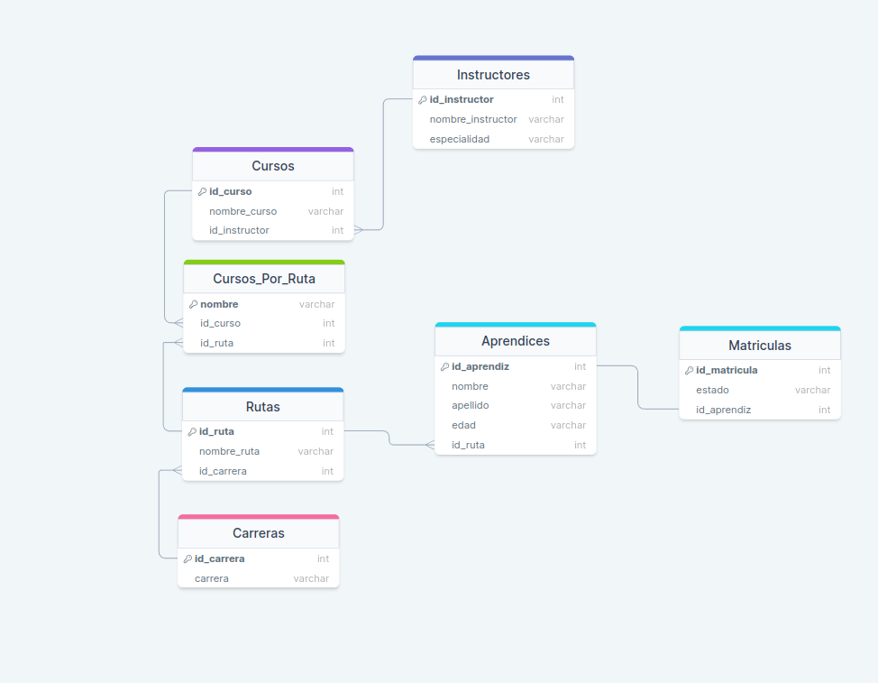

### Proyecto

##### Diagrama Relacional

 

##### Consultas

1. Agregue un campo Estado_Matrícula a la tabla Matrícula que indique si el estudiante se encuentra “En Ejecución”, “Terminado” o “Cancelado”

  ```sql
  DROP TABLE IF EXISTS `Matriculas`;

  CREATE TABLE IF NOT EXISTS `Matriculas`(
    `id_matricula` INT PRIMARY KEY AUTO_INCREMENT,
    `id_aprendiz` INT,
    FOREIGN KEY (`id_aprendiz`) REFERENCES `Aprendices`(`id_aprendiz`)
  )AUTO_INCREMENT=1;

  ALTER TABLE `Matriculas`ADD `estado` VARCHAR(45) NOT NULL AFTER `id_matricula`;

  ```

2. Agregue a el campo edad a la tabla de Aprendices.

  ```sql
  ALTER TABLE `Aprendices` ADD `edad` VARCHAR(3) AFTER `apellido`;
  ```

3. Si suponemos que los cursos tienen una duración diferente dependiendo de la ruta que lo contenga ¿qué modificación haría a la estructura de datos ya planteada?

  ```sql
  ALTER TABLE `Cursos` ADD `duracion` INT NOT NULL AFTER `nombre_curso`;
  ```

4. Seleccionar los nombres y edades de aprendices que están cursando la carrera de electrónica.

  ```sql
  ALTER TABLE `Cursos` ADD `duracion` INT NOT NULL AFTER `nombre_curso`;
  ```

------
