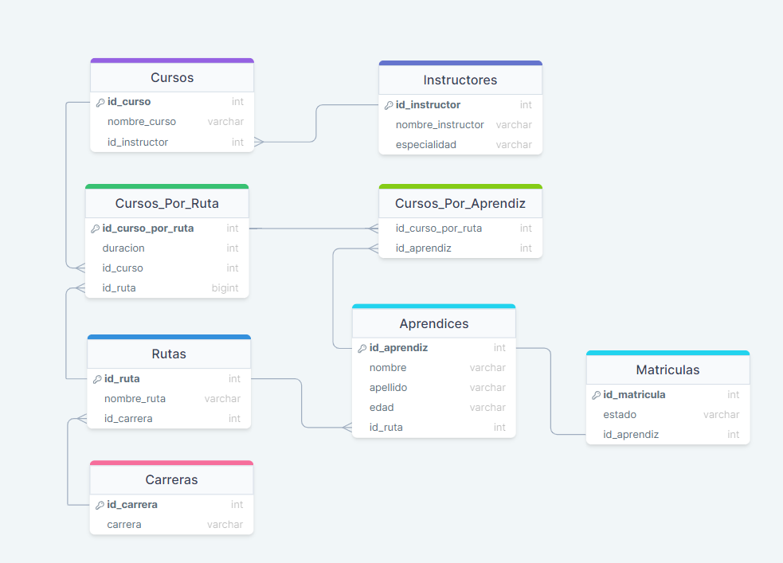
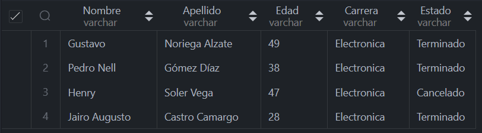
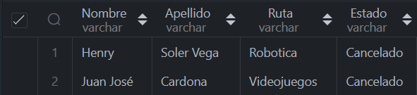
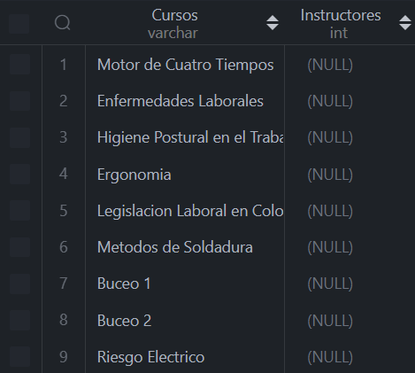
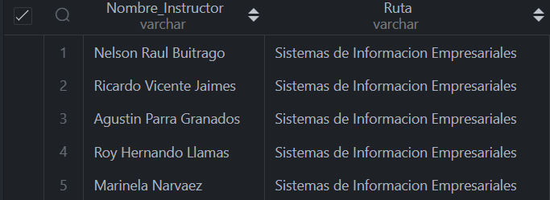
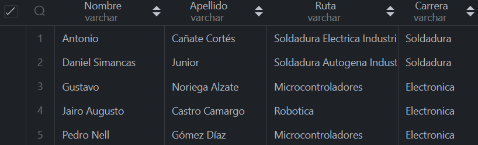
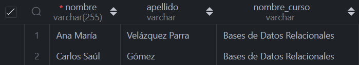
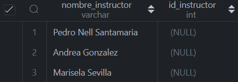

### Proyecto

##### Diagrama Relacional



##### Consultas

1. Agregue un campo Estado_Matrícula a la tabla Matrícula que indique si el estudiante se encuentra “En Ejecución”, “Terminado” o “Cancelado”

  ```sql
  DROP TABLE IF EXISTS `Matriculas`;

  CREATE TABLE IF NOT EXISTS `Matriculas`(
    `id_matricula` INT PRIMARY KEY AUTO_INCREMENT,
    `id_aprendiz` INT,
    FOREIGN KEY (`id_aprendiz`) REFERENCES `Aprendices`(`id_aprendiz`)
  )AUTO_INCREMENT=1;

  ALTER TABLE `Matriculas`ADD `estado` VARCHAR(45) NOT NULL AFTER `id_matricula`;

  ```

2. Agregue a el campo edad a la tabla de Aprendices.

  ```sql
  ALTER TABLE `Aprendices` ADD `edad` VARCHAR(3) AFTER `apellido`;
  ```

3. Si suponemos que los cursos tienen una duración diferente dependiendo de la ruta que lo contenga ¿qué modificación haría a la estructura de datos ya planteada?

  ```sql
  ALTER TABLE `Cursos` ADD `duracion` INT NOT NULL AFTER `nombre_curso`;
  ```

4. Seleccionar los nombres y edades de aprendices que están cursando la carrera de electrónica.

  ```sql
  SELECT a.nombre AS Nombre, a.apellido AS Apellido, a.edad AS Edad, c.carrera AS Carrera, m.estado AS Estado
  FROM Matriculas m 
  JOIN Aprendices a ON m.id_aprendiz = a.id_aprendiz
  JOIN Rutas r ON r.id_ruta = a.id_ruta
  JOIN Carreras c ON c.id_carrera = r.id_carrera
  WHERE c.carrera = 'Electronica' AND m.estado = 'Activo';
  ```
Sin resultado. Ninguno está cursando, ya todos terminaron o cancelaron.

  ```sql
  SELECT a.nombre AS Nombre, a.apellido AS Apellido, a.edad AS Edad,
  c.carrera AS Carrera, m.estado AS Estado
  FROM Matriculas m 
  JOIN Aprendices a ON m.id_aprendiz = a.id_aprendiz
  JOIN Rutas r ON r.id_ruta = a.id_ruta
  JOIN Carreras c ON c.id_carrera = r.id_carrera
  WHERE c.carrera = 'Electronica';
  ```



5. Seleccionar Nombres de Aprendices junto al nombre de la ruta de
aprendizaje que cancelaron.

```sql
  SELECT a.nombre AS Nombre, a.apellido AS Apellido, 
  r.nombre_ruta AS Ruta, m.estado AS Estado
  FROM Matriculas m 
  JOIN Aprendices a ON m.id_aprendiz = a.id_aprendiz
  JOIN Rutas r ON r.id_ruta = a.id_ruta
  WHERE m.estado = 'Cancelado';
  ```


6. Seleccionar Nombre de los cursos que no tienen un instructor asignado.

  ```sql
  SELECT nombre_curso AS Cursos, id_instructor AS Instructores
  FROM Cursos
  WHERE id_instructor IS NULL;
  ```



7. Seleccionar Nombres de los instructores que dictan cursos en la ruta de aprendizaje “Sistemas de Información Empresariales”.

  ```sql
  SELECT DISTINCT i.nombre_instructor AS Nombre_Instructor, r.nombre_ruta AS Ruta
  FROM Instructores i
  JOIN Cursos c ON i.id_instructor = c.id_instructor
  JOIN Cursos_Por_Ruta cr ON cr.id_curso = c.id_curso
  JOIN Rutas r ON r.id_ruta = cr.id_ruta
  WHERE r.nombre_ruta = 'Sistemas de Informacion Empresariales';
  ```


8. Genere un listado de todos los aprendices que terminaron una Carrera mostrando el nombre del profesional, el nombre de la carrera y el énfasis de la carrera (Nombre de la Ruta de aprendizaje)

  ```sql
  SELECT a.nombre AS Nombre, a.apellido AS Apellido, r.nombre_ruta AS Ruta, 
  c.carrera AS Carrera
  FROM Matriculas m 
  JOIN Aprendices a ON m.id_aprendiz = a.id_aprendiz
  JOIN Rutas r ON r.id_ruta = a.id_ruta
  JOIN Carreras c ON c.id_carrera = r.id_carrera
  WHERE m.estado = 'Terminado';
  ```



9. Genere un listado de los aprendices matriculados en el curso “Bases de Datos Relacionales”.

  ```sql
  SELECT a.nombre, a.apellido, c.nombre_curso
  FROM Matriculas m 
  JOIN Aprendices a ON m.id_aprendiz = a.id_aprendiz
  JOIN Cursos_Por_Aprendiz ca ON ca.id_aprendiz = a.id_aprendiz
  JOIN Cursos_Por_Ruta cr ON cr.id_curso_por_ruta = ca.id_curso_por_ruta
  JOIN Cursos c ON c.id_curso = cr.id_curso
  WHERE c.nombre_curso = 'Bases de Datos Relacionales' AND m.estado = "Activo";
  ```




10. Nombres de Instructores que no tienen curso asignado.

  ```sql
  SELECt DISTINCT i.nombre_instructor, c.id_instructor
  FROM Instructores i
  LEFT JOIN Cursos c ON c.id_instructor = i.id_instructor
  WHERE c.id_instructor IS NULL;
  ```

  

------
